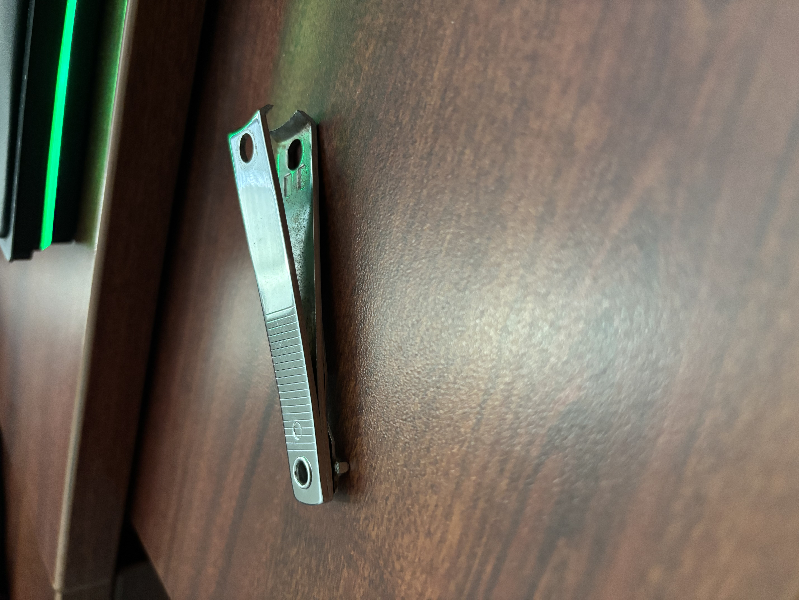
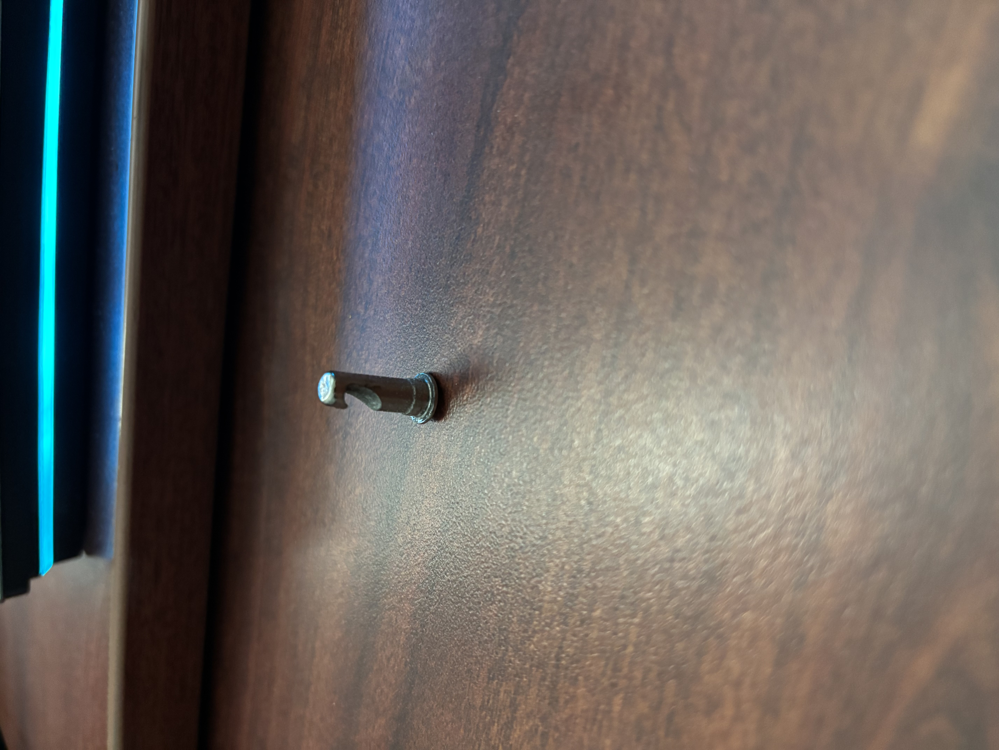
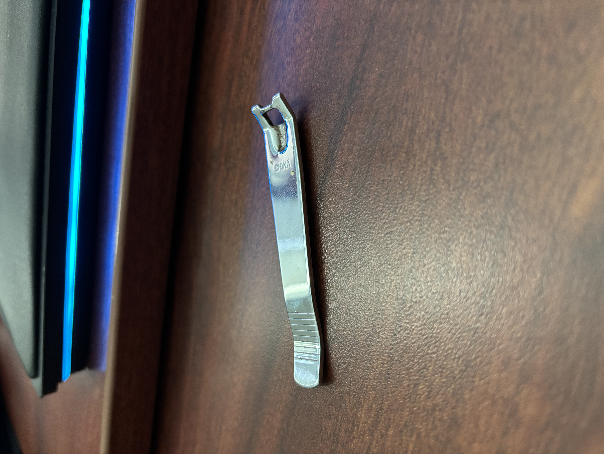

# A1 – Create Portfolio

## Objective
Find two engineering portfolios on GitHub and analyze/critique the both of them for:
Navigability, Reproducibility, Evidence of Reasoning, and Professional tone

## Analyze
                                                     --- PORTFOLIO ANALYSIS ---

Portfolio 1: https://fwachter.github.io

Navigability: Although this page is straightfoward and consice, it lacks intuitivity in the sense of going through the different sections of the site. There are five buttons on the bottom that one must click to navigate each section, which took me longer than expected to figure out how to get off of the title section. Despite this issue, it nonetheless took less than 60 seconds to find and get information on the works the owener has on his page. 

Reproducibility: The documentation on each of the owner's works do not contain enough information for a colleague to replicate the work without question. The owner's page has documentation of the work, and timelapses or use cases of the projects, but there is no step by step process or details on how each process was done. It simply suffices as a showcase of the finished product, and nothing more.

Evidence of Reasoning: The portfolio does not give any decisionmaking or steps in the process of creation. There is only a finalized design and rendering of each design, with articles attached describing the owner's team's effort in creating the design or product.

Professional Tone: Each individual project in the portfolio exudes a tone and image that of a professional. The text is consice and informative, with specifics on the dates, purpose, and ideas behind each project. I would hand this to an employer based off the organization and formatting of this portfolio.

Portfolio 2: https://nhoong.github.io

Navigability: The formatting on this portfolio is concise and to-the-point. Everything is on a single page and is easily scrollable with the mouse wheel and readily have slideshows on each project section so navigating each project's photos and captions is seamless. Any information on this portfolio can be found in under 60 seconds with ease, it is seamless.

Reproducibility: There is only one project with the capability of being replicated. The owner's senior capstone project has a very detailed document on the process and steps taken to create their project. This could possibly be recreated by a colleague just with the help of this document.

Evidence of Reasoning: In each project section, there are detailed drawings and schematics for each project. For CAD models, there are different views and images that show each individual part, anong with a caption below it defining what the image is depicting. The portfolio not only shows the finalized products, but the steps that went alongside making it.

Professional Tone: The portfolio as a whole indeed has a professional tone. Each depiction of the projects, and the summary of the owner himself is formal and is informative. There isn't excess wordage in any of the sections, they are straightforward and get the point across professionally. I would turn this in to an employer.

                                                        --- PRODUCT ANALYSIS ---

Product in Question: Nail Clippers

Patent: https://patents.google.com/patent/US5522136A/en?q=(nail+clippers)&oq=nail+clippers

a. The primary function of the product is to cleanly and effectively trim a fingernail down to a desired length with efficiency. There is a transfer of mechanical force from the fingertips through the lever, into the clamp and from the blades at the tip of the clamp, translating the force into the blades and through the fingernail. 

b. The governing model of the product is the equation of conservation of torque in static equilibrium. There are two levers working in opposition, which the torque from both ends are translated into a net force which trims the nail. The assumption that both levers are perfectly rigid bodies, since the mathematics require no torque or force to be lost in the bending or deforming of either lever in the whole system to have perfect output. The pin holding both levers together pull the design together, allowing for maximum leverage and torque translation when both ends of the levers are pushed together. 

c. : The two holes at the top of the main lever body act as a guide for the pin piece to slide into. The two blades on this lever part act as the output for the force created by the torque of the lever system.

: This pin piece acts at the anchor that ties the whole system together and allows for the translation of force into the blades of the clippers. The bottom flat head keeps the main lever body from moving downward, and the lip at the top of the pin allows for the top lever to move freely.

: This lever at the top of the clipper acts as the key piece to allow the clippers to clip the nail. Being able to adjust this lever allows for the whole product to be closed with the lever facing downward, or in use facing upward. The torque mainly comes from the downward force on the edge of this lever which is translated from the opposite end where the lever pin is, which creates a clamping force with the bottom lever which allows for the nails to be clipped precisely.

d. William Larisey is the founder of the patent of the nail clipper. The patent number is US5522136A.

Two alternatives to the nail clippers are nail files, and nail scissors. The nail file takes an alternative approach to trimming the nail, opting for a way to break it down with a harder material to provide a less effective, but easier way to trim the nail, and open possibilities to shape the nail when at a desired length. The nail scissors also utilize a different approach, snipping small pieces of the nail off rather than clipping entire layers off, which can be more precise, but requires more cuts to cut the nail.

The adjustable lever on the nail clipper surprised me with the ingenuity of its design. Compared to scissors, the option to press the lever into the other main lever allows for ease of use and very high torque translation, allowing for two finger use to create enough force to clip through any nail. The small design and use of leverage on this adjustable lever makes more sense than a traditional pair of scissors, and ends up being more compact as well.

## Decide

1. The homepage of the portfolio should convey a general consensus of what the entire portfolio is going to bring the reader in one conscise page. A reader is looking for something impressive and something that will cause them to want more when first seeing the homepage. The reader should get an understanding of the level of professionalism of the portfolio's owner, and the level of expertise their products and works on the portfolio. The homepage also cannot be too vibrant or eccentric; something visually appealing allows for the reader to comfortably analyze the portfolio. Without an appealing homepage, the reader is less inclined to enjoy and fully respect the rest of the portfolio. It is a gateway to the rest of the portfolio; it must be up to par.

2. For my template, I decided to change the colors of the text and background from green and white to a forest green and light grey. The change in colors makes it easier on the eyes for the reader, giving them a better experience when exploring the portfolio. The original white background in my experience was very bright and taxing to continuously look at. The change to a light grey background allows for an easier time reading, which will allot an easier time reading everything else on the portfolio. The green text throughout the template fits with the color scheme of grey and green, rather than having black text on a grey background, which can ruin the aesthetic of the template. The better a portfolio, the better the information the portfolio can convey information due to more engaged readers.

3. Throughout every assignment, I will provide my utmost best effort and answer every prompt like it is worth 100% of my grade, akin to a professional engineer's level of quality.

## Communicate

1. Noel Negron

2. My name is Noel Negron, I am 19, turning 20 years old and am a mechanical engineering student. My engineering is not the simple creation and optimization of products to further technology; my engineering is the representation of my likelyhood and compassion for the field I contribute to. Ever since childhood, I have been determined to get involved with the mechanical and aeronautical field, be it through playing with paper airplanes and model cars in my youth, I have kept these fields at the top of my interest.
   The difficulty of engineering is negligible; those who have the drive to succeed and the work ethic behind it will succeed regardless. Failure comes to all, but quitting is only akin to those who will it. Mechanical engineering highlights the major developments of travel and transportation of humanity. Driving absurdly fast cars, or seeing massive planes always gave me questions on how did we as humans come up with such extravagant equipment. Becoming a mechanical engineer will not only solve this question of mine, but also provide me means of creating the very things I marvelled at as a child.
  The engineer I envision and strive to become is one of great importance to the aeronautical world. I want to have an impact on taking flight and space travel to a level of unforseen heights. I want to take the level of air and space technology only seen in Sci-Fi entertainment and fabricate it in this physical world. On my current path, I am on my way to become an engineer capable of continuing this long journey led by countless other engineers of past and present, through the classes I take and opportunities I sieze in furthering my engineering portfolio and career.

3. To defend an engineering decision is to believe in the mathematics and physics behind your stance, and accept the weight that comes with said decision. An engineering decision can be as miniscule as changing the tolerance on a frame, and as important as changing the material to a supermassive machine that could potentially ruin or optimize the machine and affect the people who will use it. Making an engineering decision requires certainty and countless tests before finalizing it. I currently do not know how to defend an engineering position, as I have not sufficiently been placed into an environment that warrents such a decision. A choice like this requires expertise and experience, which I can only focus on the former, through my classes and internship opportunities.
