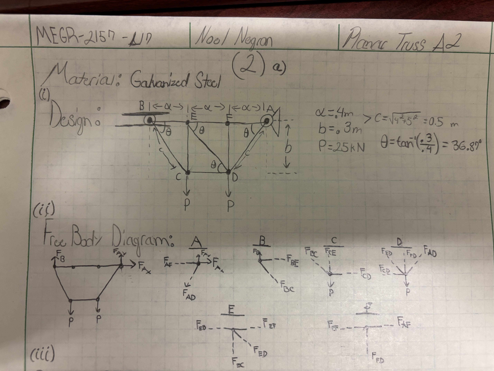
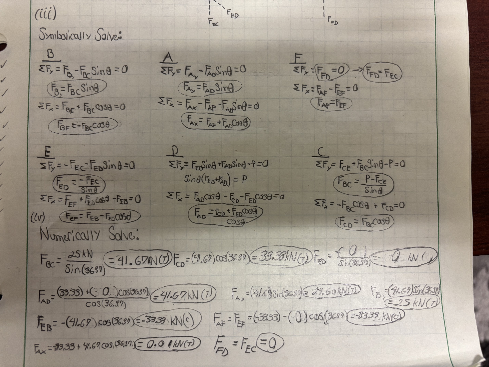
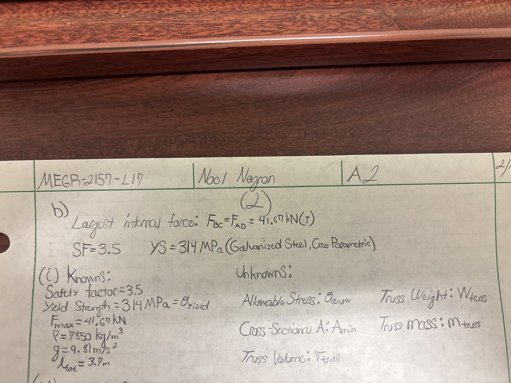
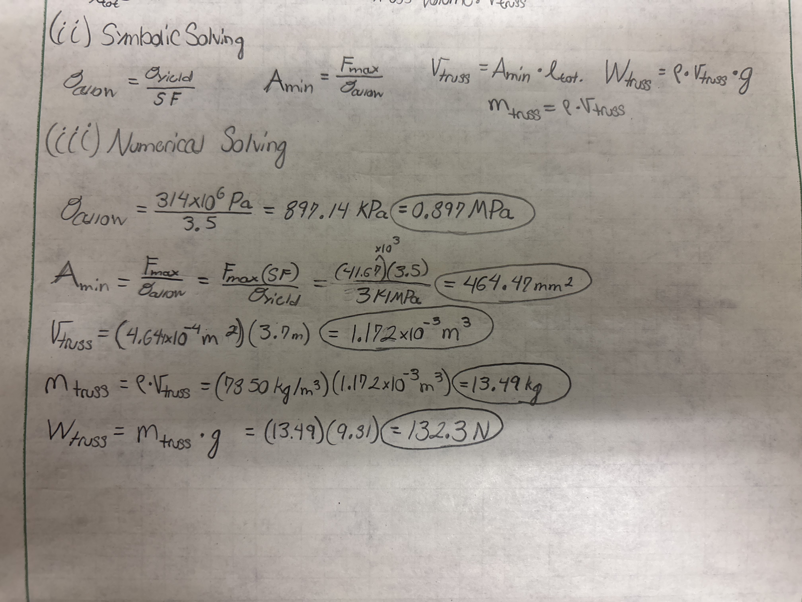
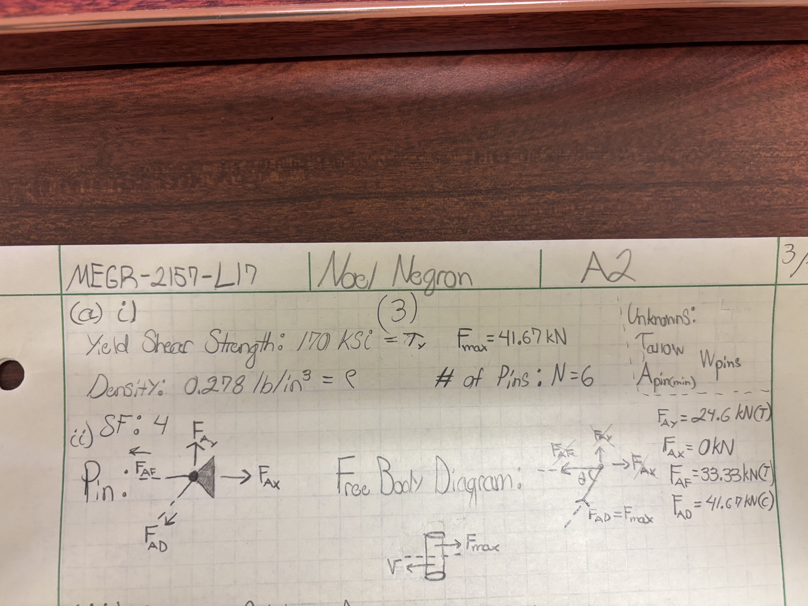
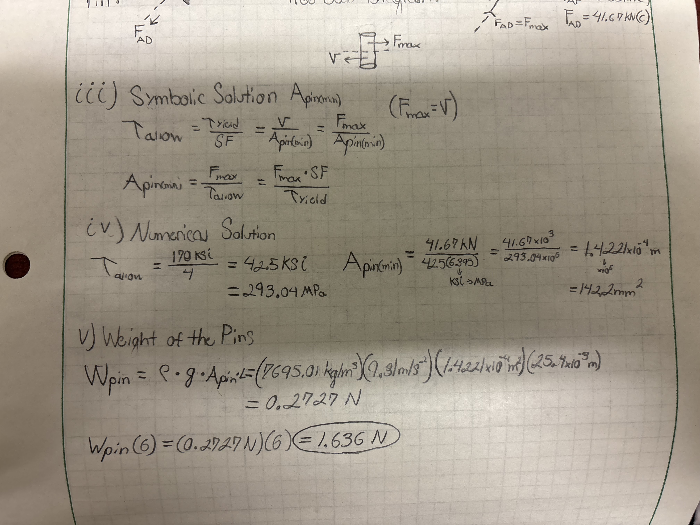
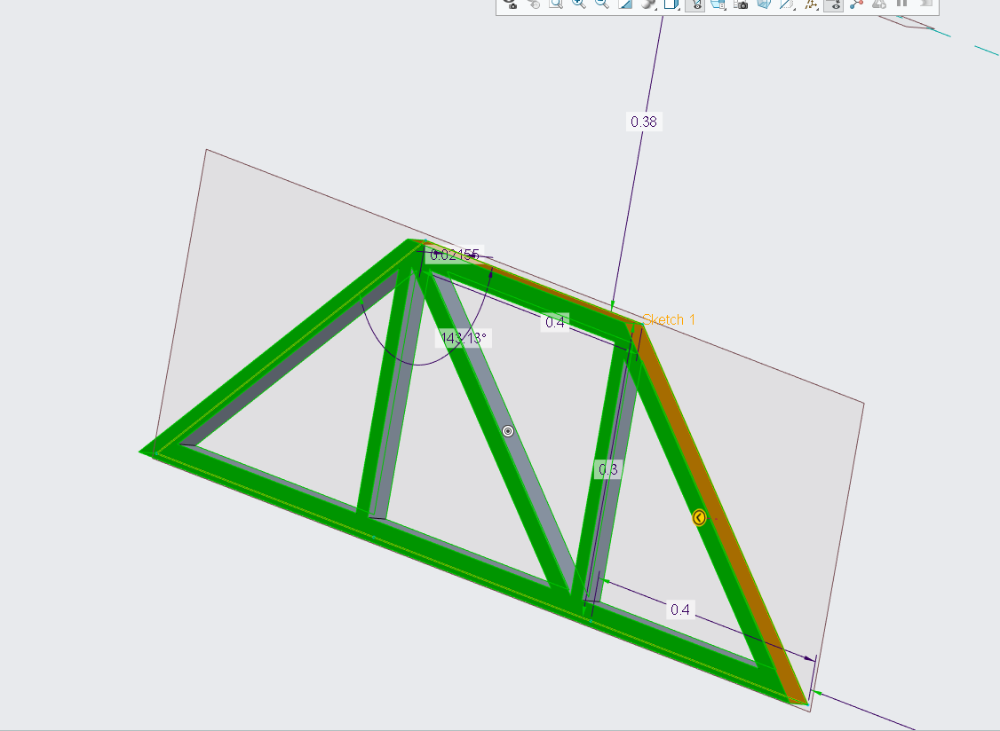
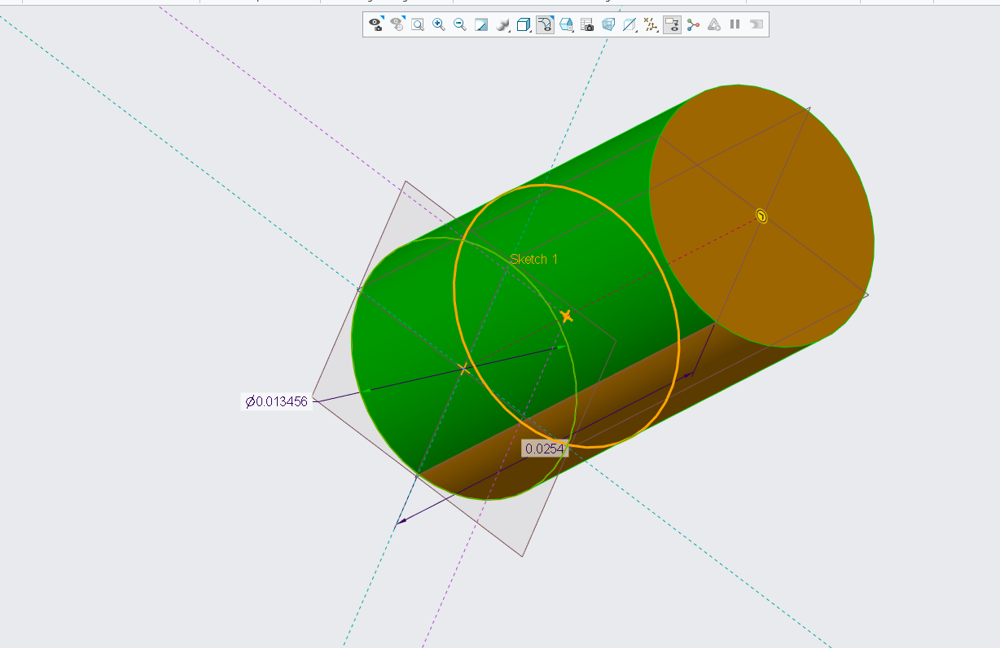

# A2 – Truss Stress Analysis

## Objective

Successfully create and model a truss within defined parameters in a 3D CAD system, and calculate every variable through the required steps.

Research the likelyhood of different failure modes in the components of a truss.

## Analyze

Throughout this assignment, I was asked to derive, calculate, and model a truss system with specific values and materials given to me. For the truss designing, we were given a pin connection, roller connection, and two required pin joints within certain lengths, provided in this image: 

 

Within these given instructions, I created a simple truss system with 9 individual members, and 6 total connections, one roller, one pin connection, and two pin joints not including C and D. As I created my truss, I was tasked to make it statically determinate with a simple design. For the free body diagram, we were required to have a whole body diagram, as well as a diagram for each and every joint in the truss. Within this next image is the design I finalized and free body diagram for it:

After designing the truss, I was tasked with both symbolically and numerically solving for each internal and reactional force on the truss to verify that it was in static equilibrium. Truthfully, I was slightly rusty in my method of sections, so I opted for doing the lengthy process of solving with the method of joints. Within this next image depicts the symbolic and numerical methods of solving for each internal and reactional force at every joint. This process took longer than I am willing to admit:

With all of the statics work for the truss complete, it was time to start the solids portion; stress, cross sectional area, volume, mass and weight. The maximum force I used was 41.67 kilonewtons as calculated from my statics work. The material required was A500 steel, but the CAD system I used, CREO Parametric, did not have it in their system of materials. I opted to use galvanized steel as an alternative, as it was most similar to the yield strength of A500 steel in the system. I firstly listed every known variable and their values, as well as the unknowns that I needed to fully finish this problem. For a quick note, the length of the truss was determined through the addition of every member utilized, which gave me a value of 3.7 meters, as displayed in the image below:

With this information, I was able to solve both symbolically and numerically for the cross-sectional area, and overall weight of the truss. Truthfully, I had trouble determining which equations to use, as I am currently taking solids alongside this course. I utilized my solids textbook to find all of the equations utilized for this part of the assignment. Through my solution, I ended up with a cross sectional area of 464.47 square millimeters. With this value, I calculated a total weight, with the use of the density, of 132.3 newtons. Below is my work shown for these values:

After the truss was completely accounted for, next was the pins. At this point I am about 4.5 hours into this assignment. This part alone took me around 3 hours to do. As I said before, I am currently taking solids alongside this course, and we had yet to go over shear strength. As of writing this, I have learned about shear strength and now understand it better than I did before. I firstly wrote down the knowns and unknowns of my problem, as well as the pin I chose and the free body diagram of joint A, which also included the maximum force on the truss of 41.67 kilonewtons. This is portrayed in the below image:

Alongside the final step of calculations for the pin, I scoured my statics textbook for equations necessary to solve for the cross-sectional area and total weight of the pins. I found the allowable shear strength with the safety factor and yield strength, which gave me a value of 42.5 KSI, which I converted into 293.04 MPa. Through this, I found the cross-sectional area with the max force divided by the allowable shear strength, which gave me a value of 142.2 square millimeters. With this information, I calculated the weight using the cross-sectional area, density, gravity constant, and length, I got a value of 0.2727 newtons per pin. For the length, I could not find a specified value for the length, so I assumed a length of 1 inch, converted to 25.4 millimeters. With this, I found the total weight of all 6 pins to 1.636 newtons. This is portrayed in the below image:

After all of these calculations were complete, it was time to recreate my truss and pins inside of CREO Parametric. Through tons of trial and error, I ended up with a final truss design that fit nearly exactly to the parameters of my calculated truss. For the length and width of the truss bars, I took the cross-sectional area of the truss and assumed it was square, which meant the width and height were the same, allowing me to come up with a value of 21.55 millimeters. With this value for length and width, I utilized the extrude tool to create the trapezoid outline of the truss, and specific lengths and angles of triangle sketches along the backside of the truss to remove material to fit the exact proportions of the truss. The angle I calculated from my statics work was 36.87 degrees, which was also a staple to help me fit exact lengths to have each truss member be 21.55mm by 21.55mm and have the right length. The truss took me around 1.5 hours to complete. With the galvanized steel material selected, the system calculated the mass of the truss to be 12.32 Kg, which is pretty close to my 13.49 Kg calculations. I left the small disparity up to the system's calculation method and the way the truss was structured with overlapping pieces.  Below is the product without the pin and pin holes:

After the truss was complete, I had to continue and create the pins in a different part. Since the pins were made up of high speed tool steel, it was easy to select in the CREO materials selection. the only issue was that the density was slightly different than what we were given, so I manually changed the density to the 0.278 lb/cubic inch, which allowed for the CREO calculations of mass be nearly identical to mine. This was a very simple design, as it was a cylinder of height 25.4 millimeters, and a diameter of 13.46 millimeters, which I calculated by taking my cross sectional area and utilizing another formula of pi times the radius squared, and backwards solved into getting a radius of 6.73 millimeters, and multiplied by two to get the diameter. The mass of the pin from my calculations was 27.79 grams, and CREO had calculated 29.47 grams. This led to the weight only differring by 0.099 newtons. My calculated weight was 1.636 N and CREO had 1.735 N. Here is the finished product image:

To conclude the assignment, I had to calculate the total weight of the truss and pins. I simply added my calculated values, which gave me a total of 133.936 N (132.2 + 1.636), compared to what the total of CREO's values, which was 122.594 N (120.859 + 1.735). Overall, this assignment truly gave me the perspective of what it is truly like accomplishing an engineering-level task. It was open-ended and gave us freedom to a certain extent, which felt adverse at first, not having strict guidelines to follow. After finding which truss I wanted to use, the rest of the mathematics fell into place, as I was able to take all of my previous knowledge and place it into this assignment and truss system. The engineering lesson I learned was that engineering doesn't just specifically require one area of knowledge to be able to succeed; you need mastery of a plethora of topics, and have a mind open enough to explore even further than your expertise to be able to come up with a solution that goes above and beyond what was asked.

## Decide - Likelyhood of Failure Modes in Truss Components

## Truss Members: 

for my truss, a lot of the members in it are identical. They experience similar forces, and are all under nearly identical risk of the same failure modes. For the longer diagonal members, BC and AD, they are both at risk of yielding. They are holding a force of 41.67 kilonewtons of tension, meaning if any chance, there would be a chance of yielding, as the tensional force is pulling them downward, which in itself leaves risks of yielding based off its definition of pulling or pushing an object past its yield strength. I recieved this definition from Surescreen Materials (https://www.surescreenmaterials.com/failure-mechanisms/buckling-and-yielding). The galvanized steel material I chose has a yield strength of 314 MPa, which is 314 kilonewtons per square millimeter, which is rated far beyond a small force of 41.67 kilonewtons. This galvanized steel is a ductile material, it will bend and stretch significantly before total failure (https://gaa.com.au/mechanical-properties-of-galvanized-steels/). Though it is improbable for any failure to happen to the steel framing, yielding seems to be the most likely cause under the right circumstances. The long member ED has no calculated force on it, therefore it is not at any risk, unlike the other two identical members. For a design modification, I can think of choosing a stronger material with a higher yield strength, since the downward force on my truss cannot be shifted nor reallocated, since its directly on the two joints the diagonal members are connected to.

For the four identical horizontal members, BE, EF, FA, and CD, these four members are more likely to fail from buckling. From my calculations, the forces on these members are nearly entirely compressional, meaning the members are being compressed into the joints. From my own common sense, this makes it more apparent that the members could possible bend inward or sideways on themselves, causing failure. The only member with tension is CD, which could suffer from yielding, like the long diagonal members BC and AD. The yield strength calculations and forces on each member is similar to the long diagonal members BC and AD, so there is no effective risk of any failure, yet the most likely option for the members under compression is buckling, and yielding for the ones under tensional force. A design modification that comes to mind is having more points of dispersion for the member, meaning more joints for the force to be distributed into, which can prevent and buckling or yielding.

Lastly, the two vertical members EC and FD have zero forces applied on them. They are at no risk of failure if there is no force applied on them. They are made of the same material, so the yield strength is the same, and with no force, there is no yielding or buckling. I have no design modifications in mind for these members.

## Pin Members:

The pins in my design are far more likely to fail than the steel truss framing. Each pin is designed identically, as a single shear  connection. I expect my pins to fail through shear, as the numbers I calculated from the shear strength of them is closer to the maximum force than any of the galvanized steel members. The pins are made of high speed tool steel, a brittle metal which has a yield shear strength of 170 KSI, which is equal to 293.04 MPa, or 293.04 kN/mm^2 (https://www.xometry.com/resources/materials/tool-steel/). the maximum force on a single pin is 41.67 kilonewtons, which ends up closer to failure considering the size of the pins themselves and the force that is on them. The pins are only 25.44mm long, and 13.46mm in diameter, which ends up at a smaller value of total shear strength than the galvanized steel at lengths of up to 0.5 meters would have in yield strength. A design modiification I would implement would to have a bigger pin size to ensure that it can withstand whatever force is put on it, so failure becomes even less of a worry. 

## Communicate

Overall, this assignment taught me how an engineering problem is structured. There is no set direction for you to go in, and everything is found by trial and error by your own work. Having this experience opened my eyes to how I must think as a prospective engineer, and what my approach needs to be as I continue on my trek to becoming an engineer. I spent around 12 hours on this assignment in total.
