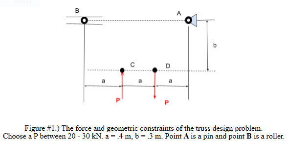

# A2 – Truss Stress Analysis

## Objective

Successfully create and model a truss within defined parameters in a 3D CAD system, and calculate every variable through the required steps.

Research the likelyhood of different failure modes in the components of a truss.

## Analyze

Throughout this assignment, I was asked to derive, calculate, and model a truss system with specific values and materials given to me. For the truss designing, we were given a pin connection, roller connection, and two required pin joints within certain lengths, provided in this image: 

 

Within these given instructions, I created a simple truss system with 9 individual members, and 6 total connections, one roller, one pin connection, and two pin joints not including C and D. As I created my truss, I was tasked to make it statically determinate with a simple design. Within this next image is the design I finalized and free body diagram for it:

## Decide
_Which geometry did you select, and why? This is your first open design choice in the course — defend it._

## Communicate

