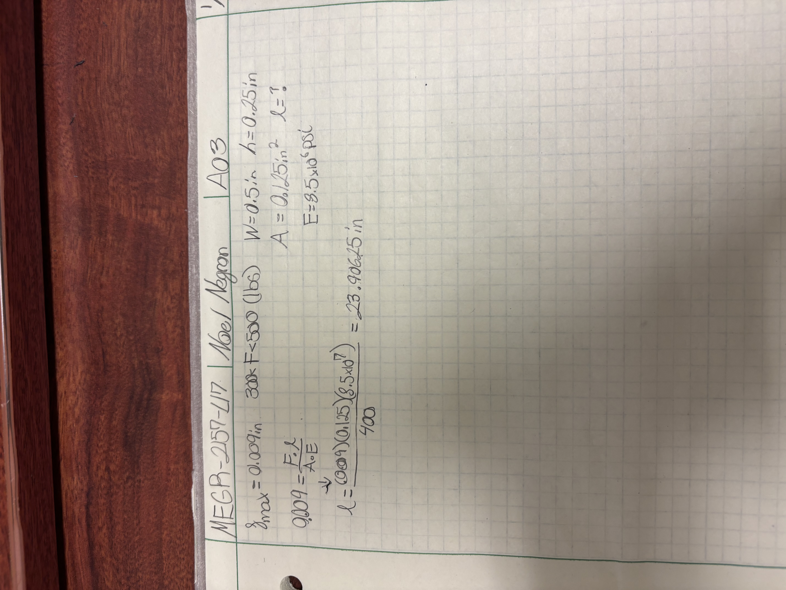
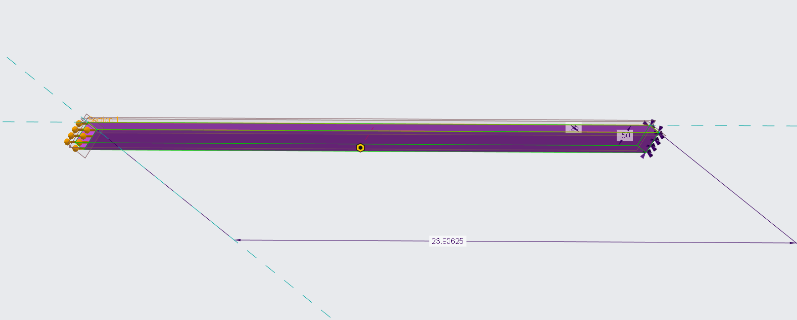
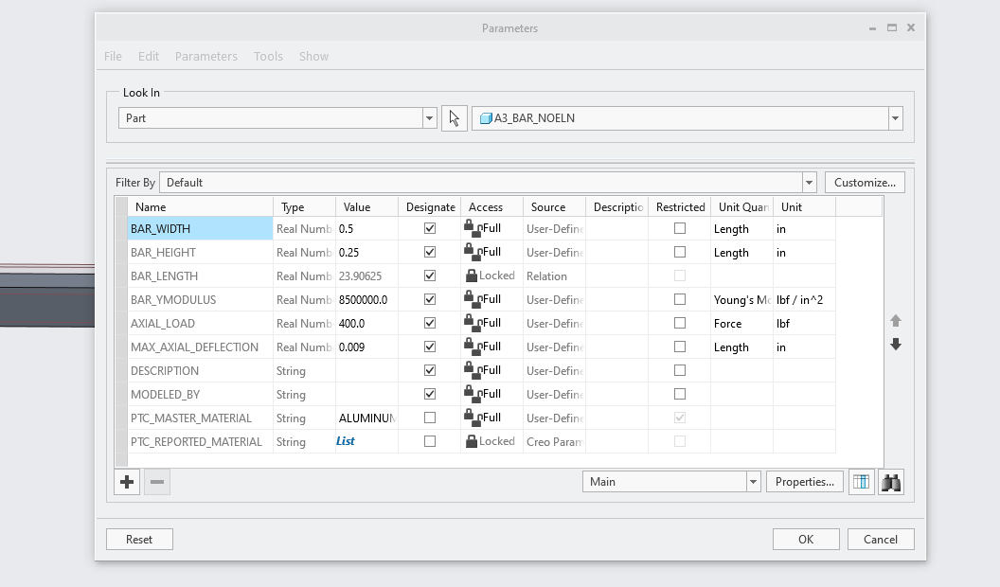
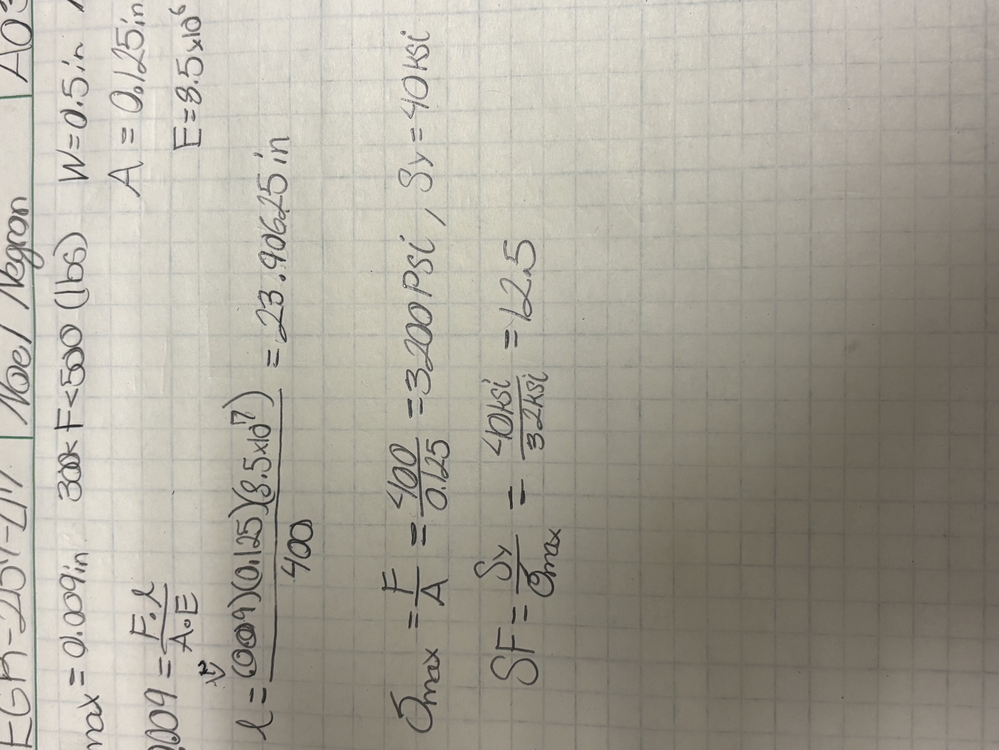
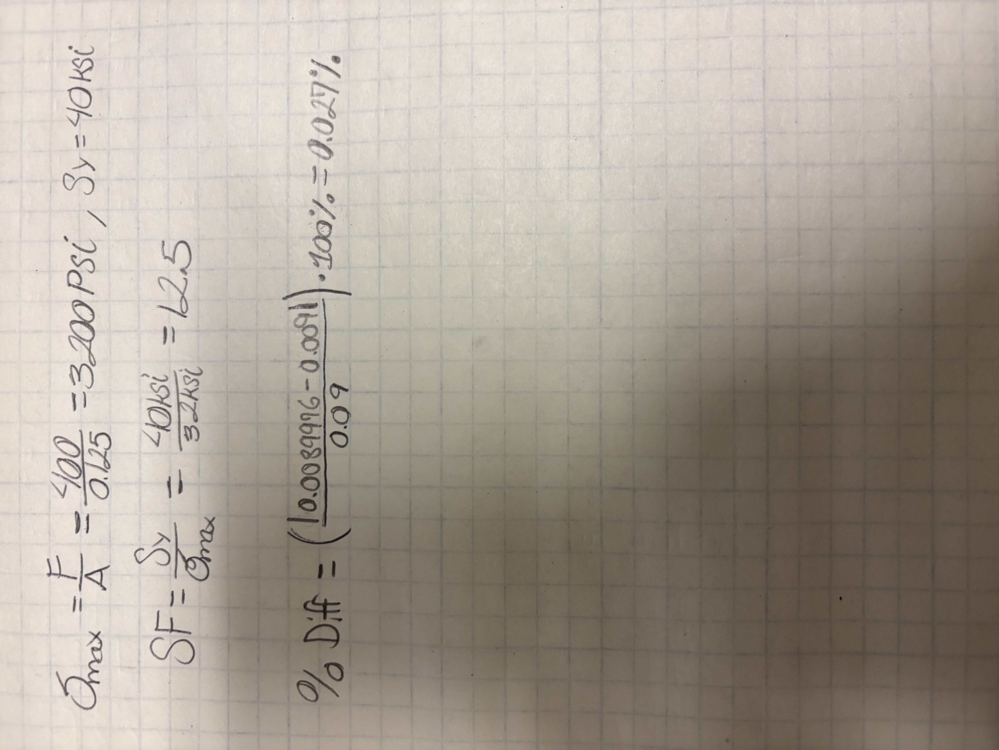
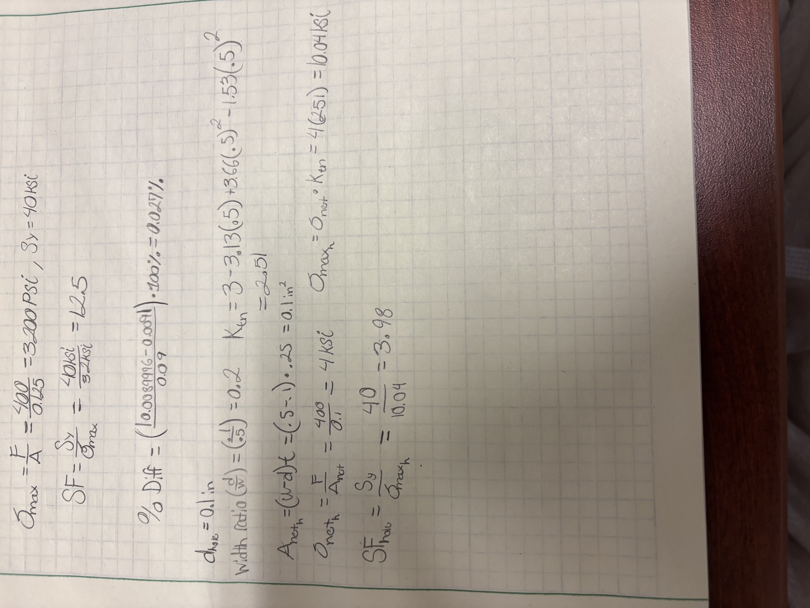

# A3 – Parametric and FEA

[A3 Noel CAD File](a3_bar_noeln.prt.2)

## Objective
1. Parametrically design a bar in a CAD system (I'm using Creo Parametric) with an applied load of 300-500lbs. The max axial deflection of the bar is 0.009 inches. The bar will be made out of aluminum, with Young's Modulus from 8.5-11.5 msi.

2. Conduct a FEA on the bar using the same load to generate the bar's geometry, generate a deflection map and a von Mises Stress map, and check if the maximum stress is lower than the strength of aluminum (Sy = 40 ksi), and note the safety factor.

3. Report my acial deflection from my parametric hand calculation and my FEA, and calculate the % difference between both. I will discuss why the values are different, or alike, depending on how varied they are, and choose which one I'd trust more for the design. I will make a decently sized pin hole on the left side of the bar, look up the stress concentration factor, and using my FEA's nominal stress away from the hole, estimate the peak stress at the hole, and determine if it would pass my safety factor.

4. 2157 Only - I will change each of my design parameters, specifically load, thickness, height and width, and determine if the length will increase before I enter my changes, and check if I was accurate or not.

## Analyze

1. Parametric  Design -

  a. The values of height and width I chose was 0.25in, 0.5in, in that order. 

  b. According to my elongation equation, I derived the length of 23.90625 inches from the equation displayed below:

  c. In Creo Parametric, I inputted my values of height=0.25in, width=0.5in, E=8.5x10^6 psi, max deflection=0.009in, and axial load=400lbs, which got me a length of 23.90625, which is exactly the value I calculated on my paper. Below are images of my parameters and proof of length on Creo Parametric:

2. Utilizing the live simulation feature on Creo Parametric was a bit of a struggle. Since there was a different method I had to use to find and use the simulate tool compared to the embedded video we were given, I had to resort to using Google Gemini to help me through it. My prompt was "The simulate tool is greyed out under applications in Creo Parametric, what can I do to use simulate?" and the response told me about my current version and the "Live Simulation" tool that was on my header that I could use instead, and from there I figured the rest out. Below this are links to my reported results from my FEA of the Von Misses Stress map, and the Deformations map:

[deformations report](deform_report_noel.html)
[Von Mises Report](von_miss_report_noel.html)

  c. The maximum stress I calculated was 3200 psi, or 3.2 ksi. The safety factor, calculated with Sy= 40ksi, was 12.5, shown in my calculations below:

3. Design Reflection

   a. The axial deflection from my hand calculation was exactly 0.009 inches, and the FEA calculated a value of 0.0089976. The percent difference, shown by my calculations below, was 0.027 percent. These values are nearly identical. Before this nearly exact calculation, I had ran into an issue with my material properties and units. I had firstly gotten a value of 1.9*10^-5, which is nowhere near 0.009 inches. I realized my force units were in lbm, when they were supposed to be in lbf. Changing this unit for the force brought my value to what it is now.

  iii. I would trust the simulation's result more for this design due to its precision to 4 more decimal places, which to me seems way more precise and therefore effective in its purpose compared to the 3 decimal place value of the handwritten deflection.

  b. With the calculated stress concentration factor (Kt), I got a value of 2.51. With my nominal stress away from the hole, the peak stress I calculated was 10.04 ksi. With this value, the safety factor I calculated was 3.98, which is greater than 1, which means it would still pass my safety factor, although it dropped from 12.5, which is a pretty decent drop compared to the rest of the bar. This would become a significantly weaker point.

## Decide

2157: Modify Design Parameters

  a. I am going to change the width, height and load of the bar to 0.75in, 0.15in, and 325lbs in that order. The thickness is the same as the height. I assume the bar length is going to change due to different calculations with the load and cross sectional area.

  b. After I calculated, the length did change, specifically to 26.480769 inches. This is in line with my assumption that the length of the bar would change.

## Communicate

4. Lessons Learned -

   a. Throughout this assignment, I learned how annoying it is to try and troubleshoot a CAD system through different versions, but most importantly, how to use the live simulation tool in Creo Parametric to analyze the Von Misses stress and displacement map, as well as about the stress concentration factor for a hole in a flat bar in tension. Overall it was a fun assignment, and I spent around 3 hours total completing it, a lot shorter amount of time compared to the previous two assignments.

