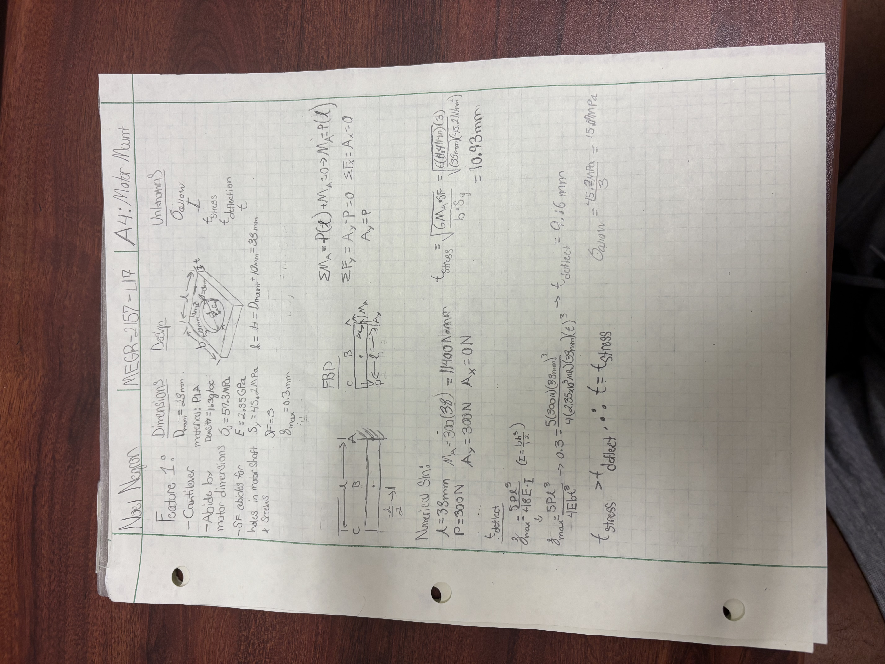
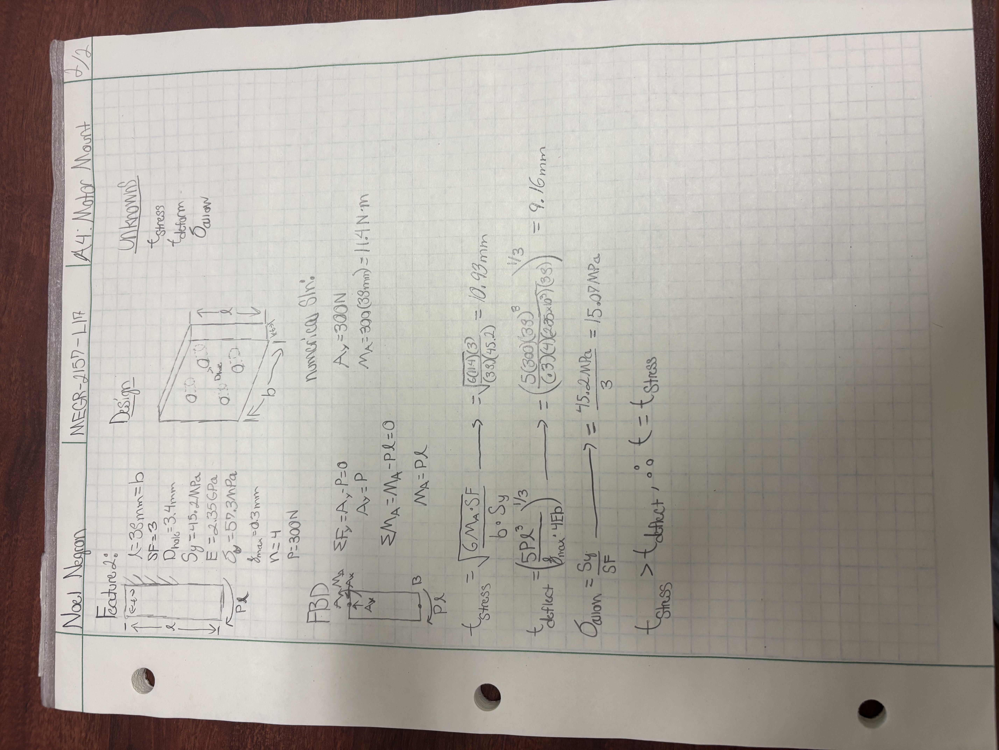
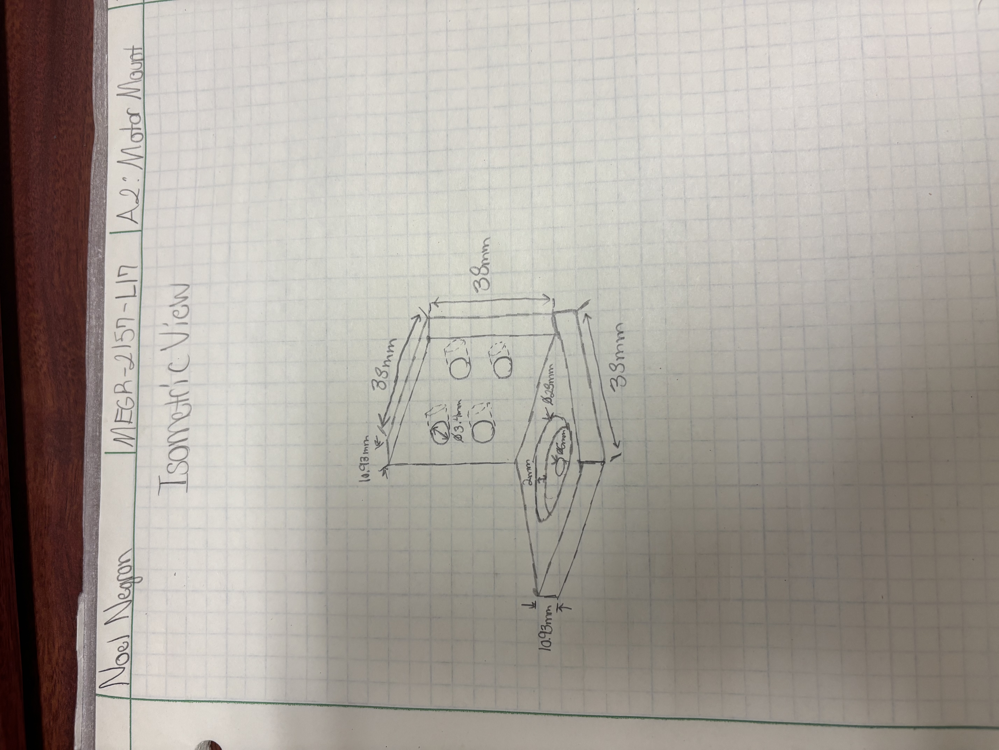
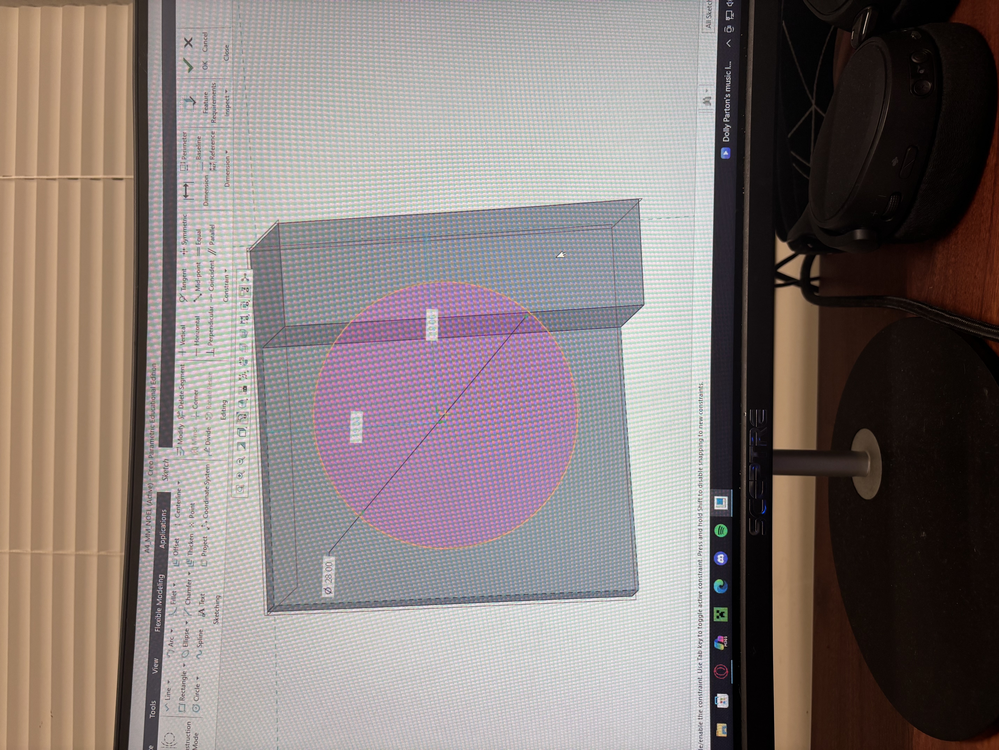
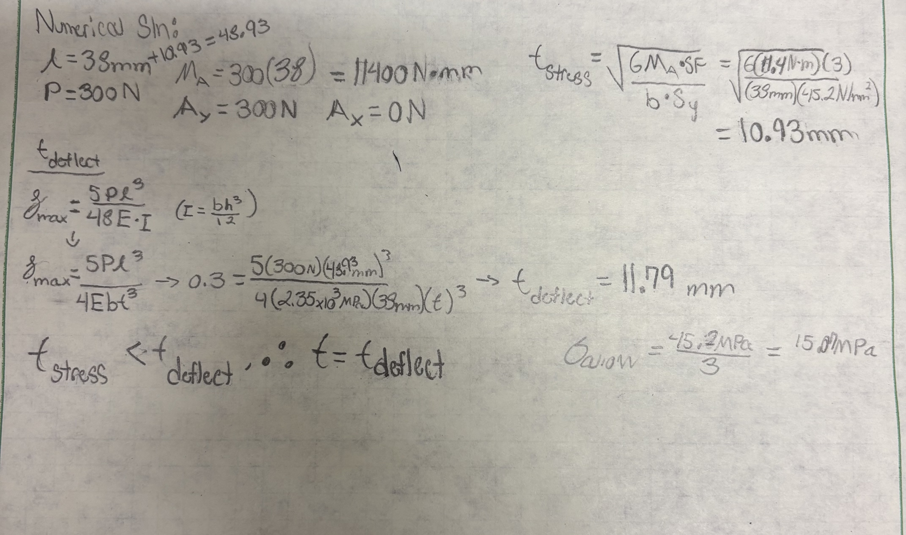
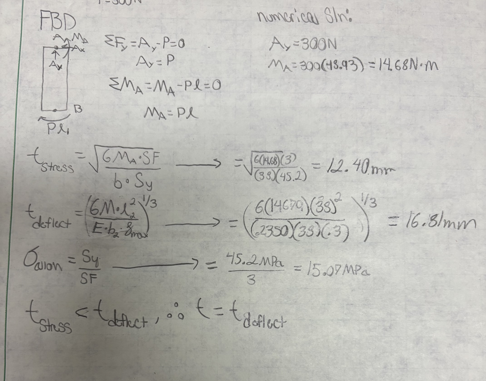
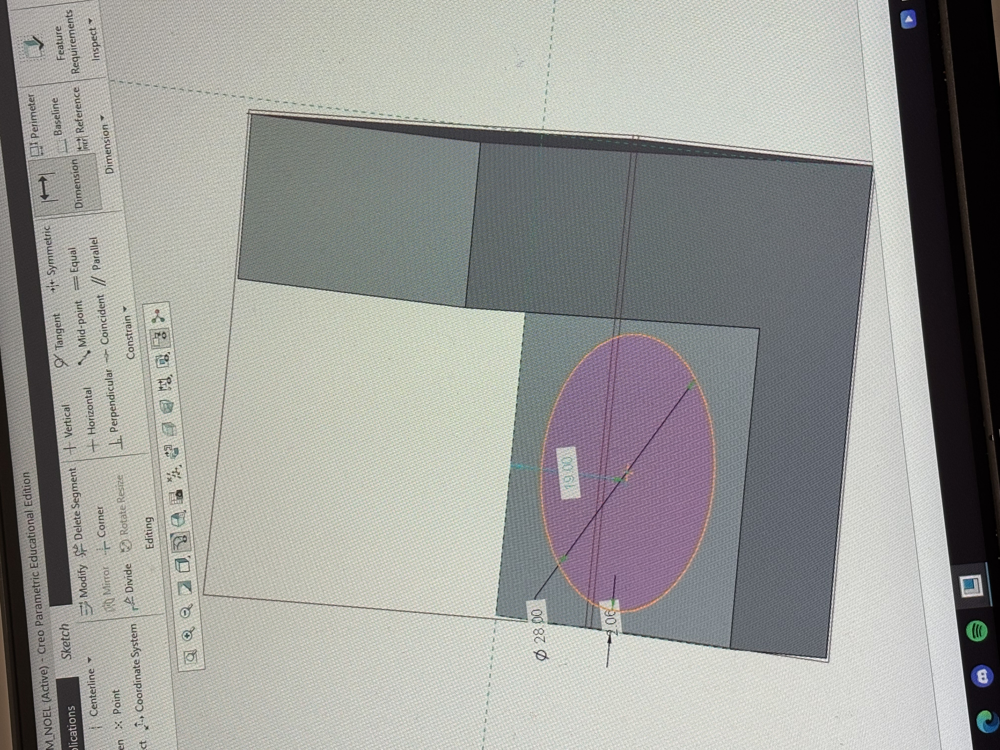
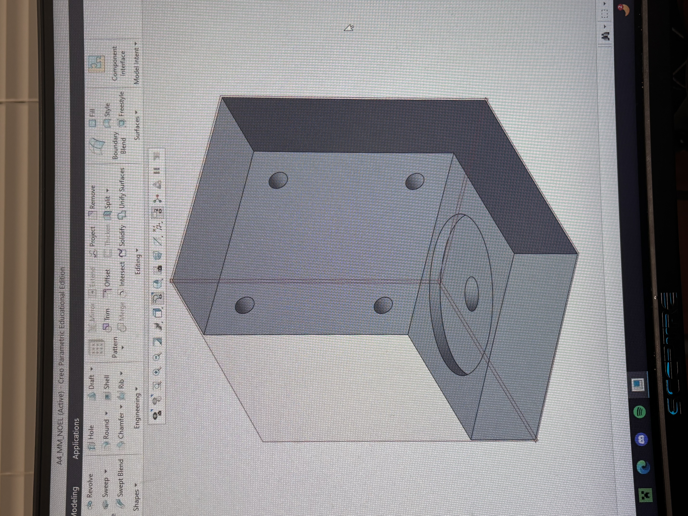
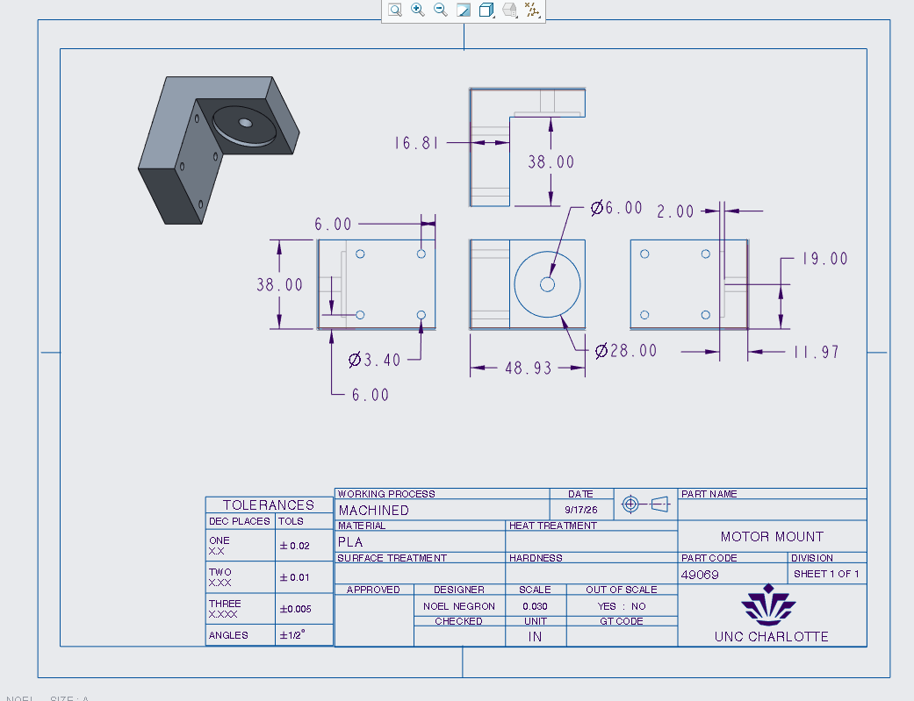

# A4 – [Motor Mount]

## Objective

1. Design a motor mount by:
   a. Designing 2 figures, 1 cantilever beam and another beam on top of that seperately, finding the thickness built for stress and deformation, and choosing the bigger one for safety and ease of access.
   b. Design the motor mount in a CAD system.
   c. Make a drawing sheet with adequate dimensions of said motor mount.

## Analyze

1. Figure 1:
  a. Beginning this assignment was quite annoying for me to do, as I got sick immediately after I started it. I fought through it and got it done anyways. Here is what I did.
  B. I started off by firstly formulating the length and free body diagram of the figure 1 of the motor mount. It was stated that it had to be a cantilever beam, with a safety factor of 3. I labeled my unknowns, did
my static equilibrium, and got to my thickness values of stress, being 10.93mm and 11.79mm, in order of stress and deformation. Since deformation thickness had a higher value, that was the thickness value I went for with my entire figure. I assumed that the beam's length was equal to its width, making L and B equal to eachother. This allowed me to only have to solve for thickness in my process. Here is my work shown:

2. Figure 2:
   a. Figure two was a little confusing, as I had to think about how to structure my free body diagram. Since the long length of the bar was attached to a rigid wall, I wondered where to put the moment reactions. I ended up leaving one at the top of the beam, and the translated moment of the bottom of the bar from figure 1, as shown in my free body diagram below. In calculating the thickness, I got a stress thickness of 10.93 and 9.16 for deformation. There is a problem I ran into later on, while structuring my design in CAD. I used the thickness of 10.93mm. Here is my work shown below:

   b. I was tasked with creating an isometric drawing before creating my design in CAD. Here is my isometric drawing:

4. Creo CAD Modeling:
   a. As I entered my dimensions and sketches into Creo Parametric, I extruded my beams and got the baseline shape and geometry. Note that the length of the figure 1 beam is still 38mm. When I went to add the diameter of the motor mount on the top plane of the figure 1 beam, there was no room to fit the diameter hole and the thickness of the figure 2 beam on top. Here is a photo of my problem:

   b. I decided to add an extra 10.93mm of length to the length of beam 1, which made me go back and redo all of my calculations for the thickness of each beam. I ended up with a thickness of 11.79mm for beam 1, and a thickness of 16.81 for beam 2. Here below are my revised calculations:

  c. After I fixed these mistakes, I had enough room to insert my diameter hole in the top plane with ample clearance (2.06mm) on each edge of the hole. After, I added the screw holes into the front plane of beam 2, with a diameter of 3.4 as given to us from the document. I had them 6mm from each side of the square-prism beam. Here is the finalized Creo design before it is made into a drawing:

## Decide

3. Creo Drawing(2157):
   a. After finishing my Creo design, I was tasked with creating a drawing with ASME proportions and adequate views enough to allow someone to recreate my design without having to open the design file itself. I added every dimension I needed to, without any overlap and with ample space to read and see where everything is marked and placed with hidden lines. Here is my drawing sheet:

## Communicate

This assignment took me about 6 hours inbetween being sick and fighting other priorities. It would have been much faster and easier if I wasn't in poor physical health.
