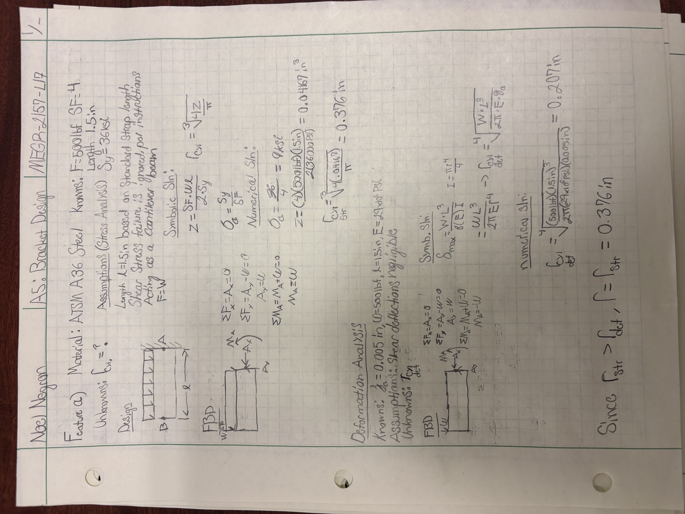
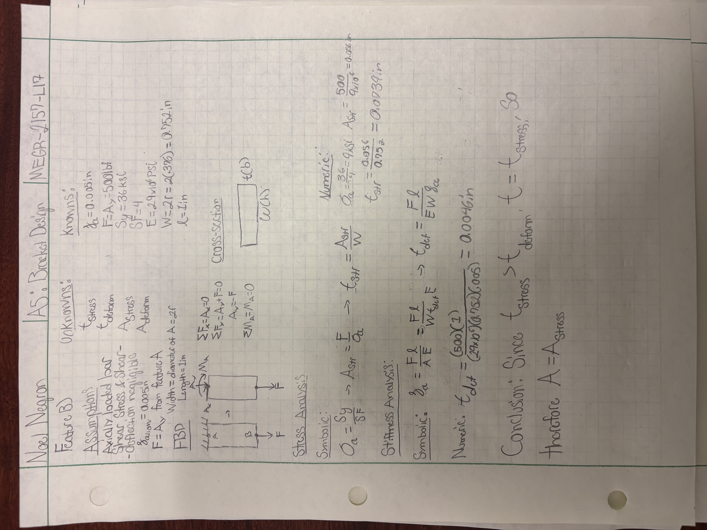
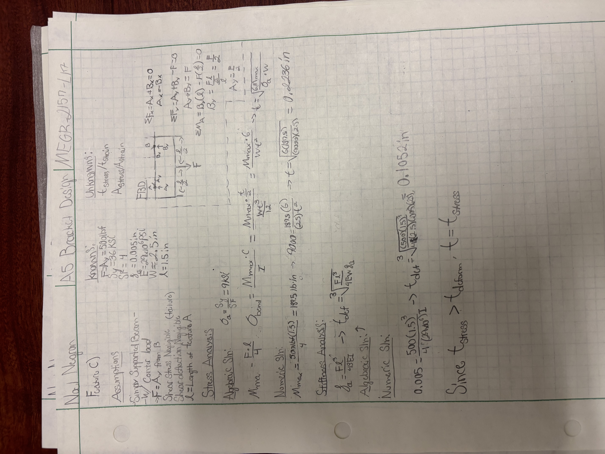
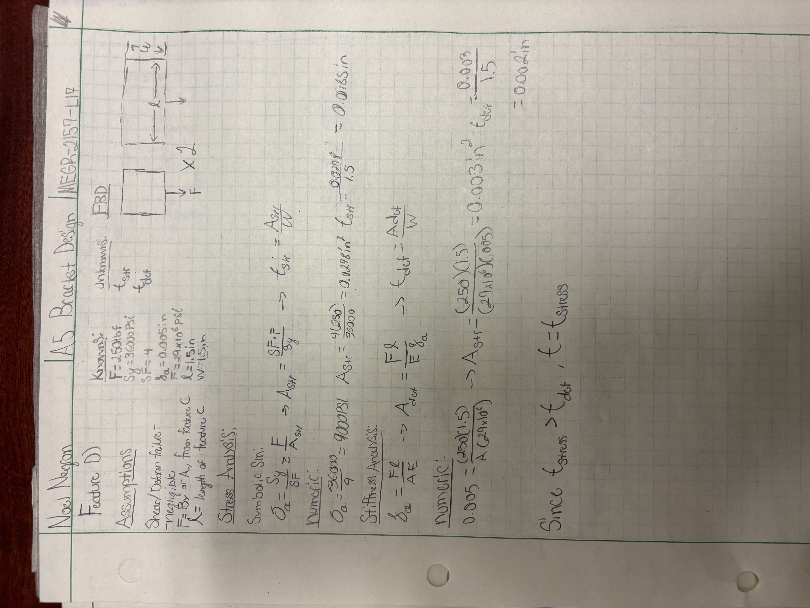
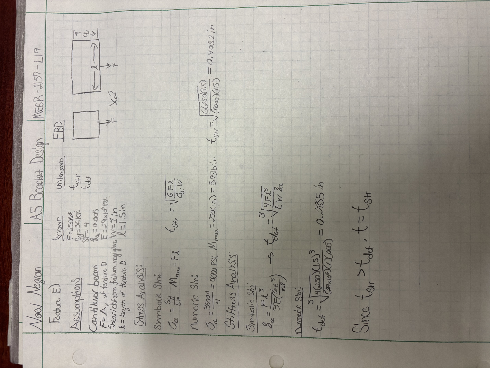
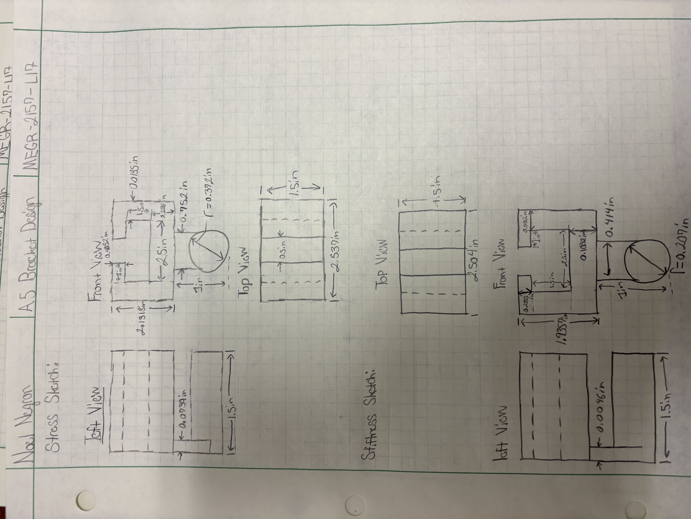
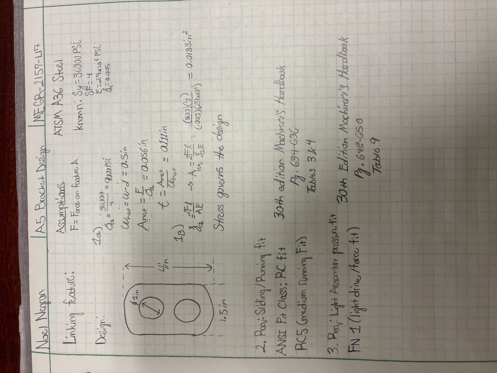

# A5 – Bracket Design

## Objective

1. Create a bracket with specific dimensions gathered through stress and stiffness analyses to prioritize a safe build and ensure structural integrity.
2. Create two multiview sketches on paper, one with the stress analysis dimensions, and the other with stiffness analysis dimensions
3. 2157 only - Create a fit that goes on the cylindrical feature of the main bracket and determine the dimensions with a stress and strain analysis.

## Analyze

1. Stress and Stiffness Analysis + Dimensions

  a. Above lies all of my work shown for the bracket design. This process was a fun one, as it required me to change up my stress analyses depending on what kind of beam each feature was. The difference is apparent in feature B's stress analysis compared to feature C's, and the rest are also somewhat distinct. The stiffness analyses remained around the same. The hardest part was distinguishing which analysis to use to find the right answer for the thickness, as this took me quite a few attempts on feature C, D, and E in determining which stress analysis worked and gave me an answer that wasn't thinner than a sheet of paper.

2. Multiview Sketch

   a. Above lies the multiview sketches with the thickness values I attained from the stiffness and stress analyses on each feature. This was the easiest aspect of this assignment, since it didnt take nearly 8 hours like the first part.

 3. Fit Analysis

  a. This 2157 exclusive part was my least favorite of the whole assignment. After spending so much time beforehand working through the analyses, having to do something else right at the end was just a cherry on top.  I used the same stress and stiffness analysis as I would for an axially loaded beam, which gave me the information laid above. I made sure the diameter of the holes were 1 inch as specified, and labeled what pages from the Machinery's Handbook, 30th Edition, and the pages and tables I chose my manufacturing methods from. For part 2, I took from tables 3 and 4 (pg. 634-636), aiming for an RC5 fit. For part 3, I took from table 9 (pg. 648-650), and chose an FN 1 fit.

## Lessons Learned

4. Governing Failure Mode

   a. For every single feature, stress governed the thickness. The most disparity between the thickness was on feature B. My stress thickness was 0.0739 inches, and my stiffness thickness was 0.0046 inches. There is over a factor of 10 in difference of thickness between both analyses. This is absurdly different, and chosing the stress thickness is a must. The thickness of 0.0046 inches is almost identical to the thickness of paper. This would absolutely not satisfy the stress failure margin, so the stress thickness must be chosen.

5. Error Propagation
   b. The splitting of the force from feature C into two equal halves nearly caused me to mess up all of my later calculations for feature D. Since we were supposed to carry on the force from the previous feature into the next one, as I was starting feature D, I wrote down 500lbf instead of the 250lbf since Ay and By on feature C were equal to F/2, making the new force on feature D and E 250lbf. I noticed that my calculations for the stress thickness were higher than I thought, so I double checked my sheet for feature C and the current feature D, and realized I had used a force of 500lbf, which increased my calculations for the stress analysis by almost a factor of two. I fixed this, and saved the trouble of going further with a messed up force value and therefore thickness.

6. Assumption Sensitivity
   c. The biggest assumption I made in this assignment was assuming the length of each feature, specifically feature B. I gave it a total length of 1 inch, which was in accordance to the width it had, and the thickness it would need. If this length value was off, the thickness value for the stiffness analysis would change, and could possibly be bigger than the stress analysis thickness, which changes the overall shape and dimensions of the whole bracket, therefore making my calculations wrong. This would cause me immense mental pain, as I have already spent so much time on this assignment.

## Communicate

Overall, this assignment took around 9 hours total, most of it spent at night after splitting my sleep into two portions. I would sleep at 10-11, and wake up around 2-3 and work until 5-6, then sleep until 9-10 and continue my day. This method saved me the hassle of worrying about getting my work done in the day, since I had enough time at night to finish it all. This was the most fun I've had doing an assignment thus far.
