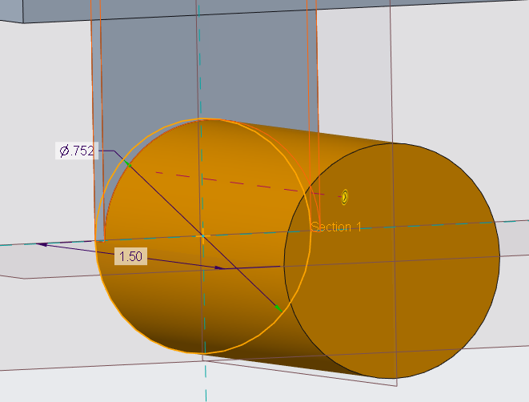
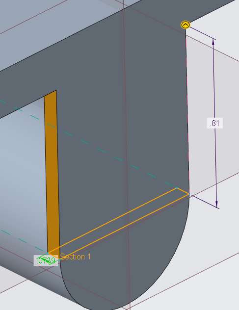
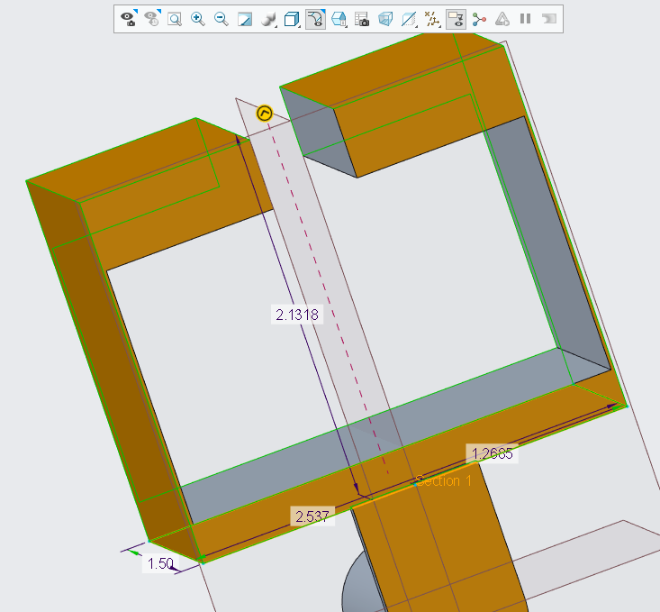
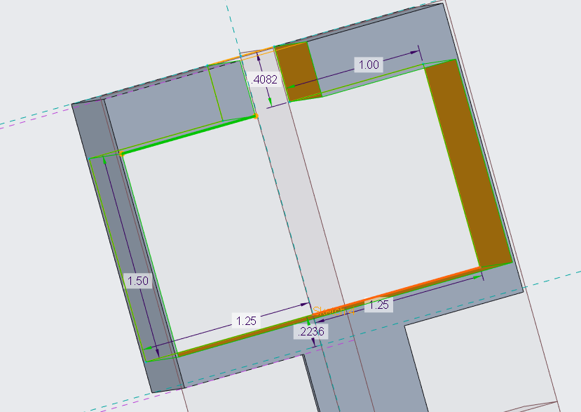
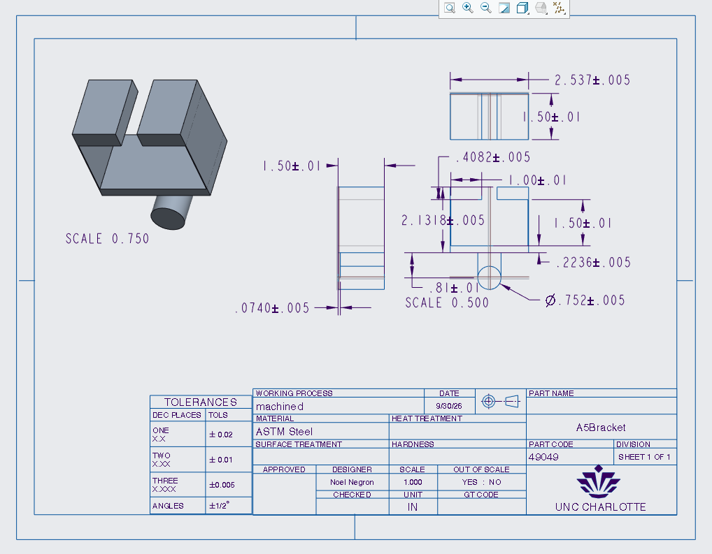
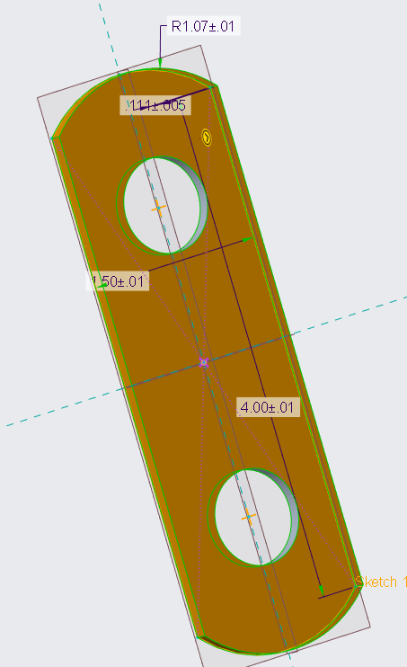
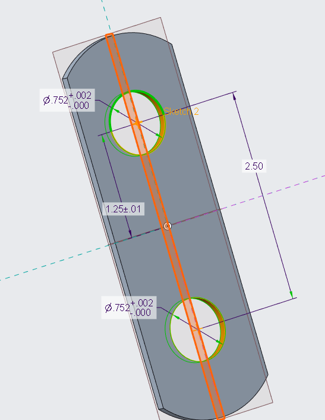
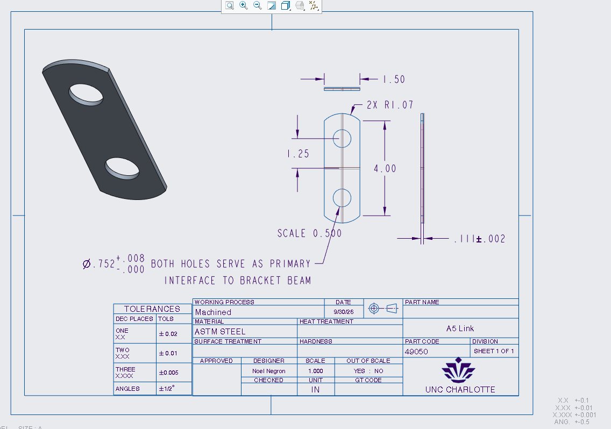

# A6 – Bracket Drawing

## Objective
 - Using the calculations from assignment 5, in a CAD system, parametrically design the bracket.
 - With this bracket, create a drawing inside of the CAD system, with fully dimensioned parts and tolerances to spec.
 - 2157 Only: Parametrically design the link with the calculations from assignment 5 and create a fully dimensioned drawing of said link.

## Bracket Design

Above lies the parametrically designed bracket from all the dimensions I utilized from my calculations on assignment 5. Throughout the parametric process, I questioned the thickness of feature D on my bracket. it has a thickness of 0.0185 inches, which was on the thicker end for stress calculations. I ended up redoing my math to see if it was correct, and to behold I was right the first time. the stress calculated thickness of 0.0185 inches is mathematically correct. this made the bracket look unproportional, but it works, so I decided to leave it be. This part of the assignment was very easy, since I am very comfortable with Creo Parametric. The timing was about 15 minutes, outside of creating the drawing next.

Above is the dimensioned drawing of the bracket I calculated in assignment 5. all the tolerances I listed are within specified ranges of what the dimensions entail. Some are lenient, and some need to be tight depending on the use of the part. Specifically the cylindrical beam, feature A, of the bracket is held to a tolerance of + 5 thousands of an inch. This must be very precise, as the link I created is just big enough for the feature to fit through, meaning it has to be nearly perfect to fit. A piece I was lax on was the length of the feature A. The length of the bracket was only precise to ten thousandths of an inch, which I gave a tolerance of plus or minus ten thousandths of an inch, since steel has such high yield strength, that ten thousandths of an inch won't cause catastrophic yield failure of the part. If a part is held to a dramatically high tolerance, the cost of precision and manufacturing skyrockets. While precision is great for functionality, it also negatively impacts the cost-efficiency of creating a part. Allowing bigger tolerances within safety factors can save a ton of money and time when it comes to the manufacturing process. This drawing took me around 10 minutes to get all of the dimensions and tolerances correct.

## Link Design

Above is the parametrically designed link I created using my A5 work, plus an extra dimension and a tweaked hole diameter. In A5, I had originally had the diameter of the holes at 1 inch. This is far too wide compared to the diameter of the beam on the bracket of 0.752 inches. That leaves a gap of nearly 1/4 of an inch in open space. That simply would not do, so I changed the calculation and diameter to the exact 0.752 inches, with a tolerance of + 8 thousandths of an inch, and no less. With this tolerance, since the beam can be only be above  by five thousandths, will fit nearly perfectly, with an almost exact sliding fit as required by the assignment. I was also more exact with the outer dimensions, as 4 inches and 1.5 inches for the length and width are exact to the link, and having a tolerance for such numbers would be redundant. This portion of the assignment was very simplistic, considering the simplicity of the part itself. This took me 20 minutes between the part and the drawing.

## Review

Overall, this assignment combined with A5 took me around 12 hours total. A5 took the majority of the time, while this was on the easier end. This assignment itself took me only two hour between the parametric designs, drawings, and writing the review. This whole segment of assignments was fun and opened my eyes to the reality of manufacturing and tolerances, along with the importance of finding the higher of the stress and strain calculations to find the best dimensions for a part.

[A5 Bracket Design](a5bracket_noel.prt.zip)
[A5 Bracket Drawing](bracketdraw_noel.drw.zip)
[A5 Link Design](a5link_noel.prt.zip)
[A5 Link Drawing](a5linkdraw_noel.prt.zip)

